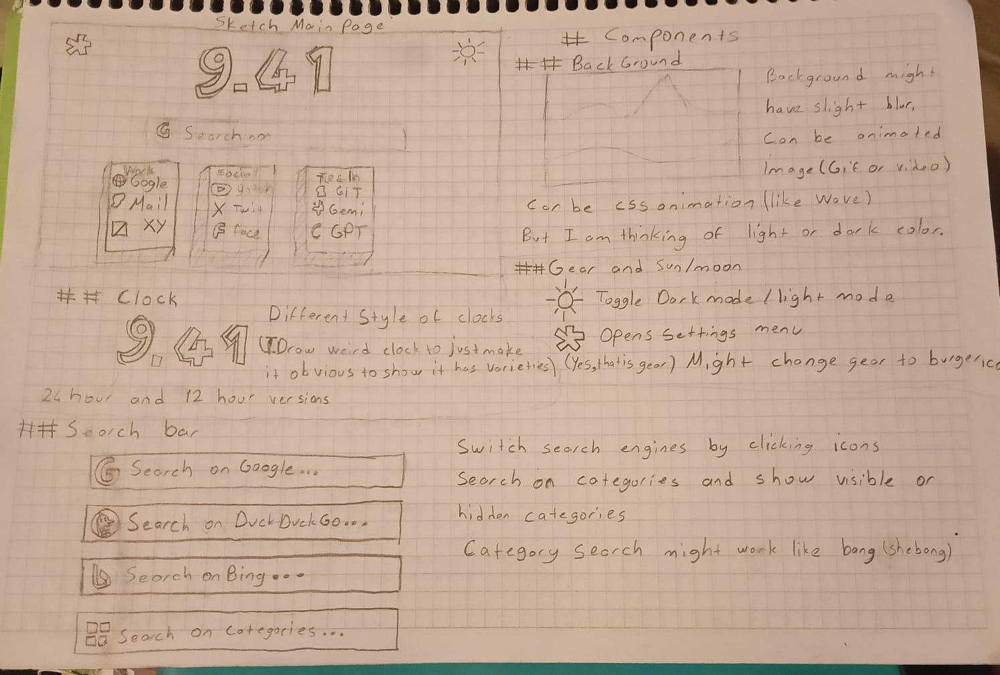
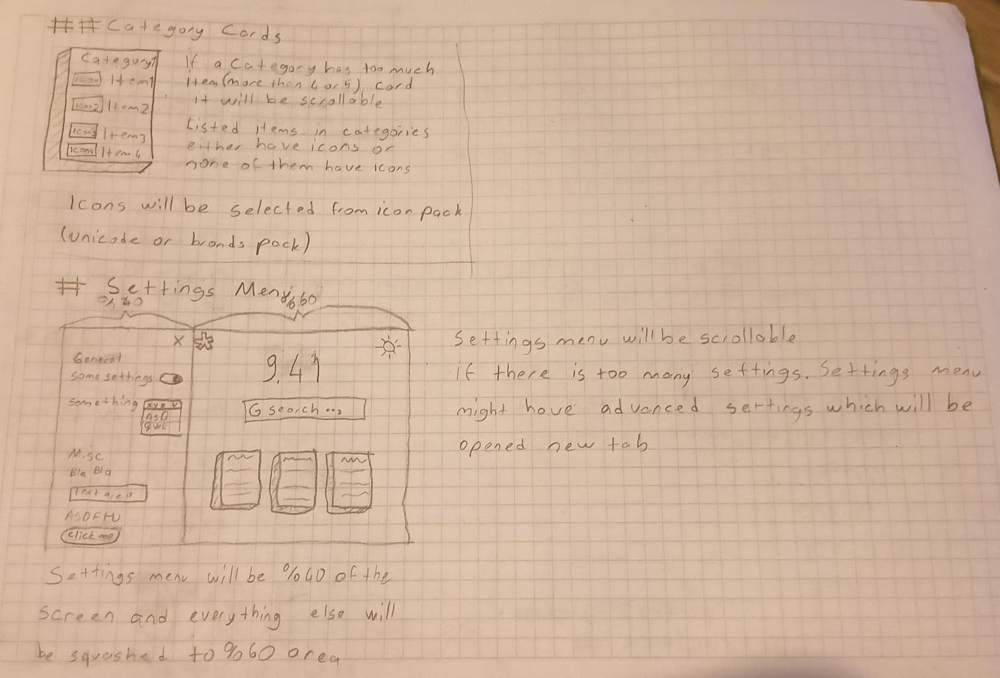
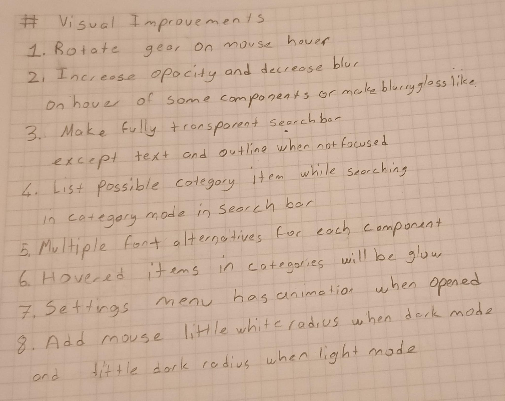

# Browser Home Page

**English** · [Türkçe](./README.tr.md)

A custom new-tab / start page built from a hand-drawn notebook sketch.
Vanilla HTML, CSS and JavaScript — no build step, no dependencies.

---

## Features

### Clock

- Live time, click to flip between 12-hour and 24-hour formats
- Five visual themes: **Minimal**, **Outline**, **Glow**, **Gradient**, **Glass**
- Custom colour with opacity (`rgba` via a hex picker + opacity slider)
- Blur slider (applied to the text only — the glass panel stays sharp)
- Size slider (50–200% of the responsive base font-size)
- Outline width slider (only shown when the Outline theme is selected)
- The **Glass** theme has a tint palette (six soft colours)

### Search

- Three default engines (Google, DuckDuckGo, Bing); switch by clicking icons
  or pressing `Shift+1` … `Shift+4`
- Engine changes from icons / shortcuts are **transient** — the persisted
  default (set in the settings panel) is untouched and restored on reload
- 15 built-in site `!bangs` à la DuckDuckGo:
  `!yt` `!gh` `!w` `!so` `!r` `!maps` `!img` `!mdn` `!npm` `!a` `!tw` `!tr`
  `!g` `!ddg` `!b`
- **Category** search mode: `!work cats` filters items inside a category,
  with live suggestions as you type
- Hidden categories are searchable but don't render as cards

### Categories (shortcut cards)

- Add / rename / remove / **reorder** categories and the sites inside them
  from the settings menu (accordion editor with an item-count badge)
- Cards-per-row preference in settings (3 / 4 / 5 / 6)
- Icons are real site favicons (DuckDuckGo's icon service) with an
  emoji fallback when the favicon fails to load
- Cards scroll internally when a category has more than five items

### Background

- Four types, switchable from settings:
  - **Waves** — animated SVG layers drifting slowly (respects
    `prefers-reduced-motion`)
  - **Solid colour** — colour picker
  - **Image / GIF** — paste a URL **or** upload a local file
  - **Video** — paste a URL **or** upload a local file
- Uploaded media is stored in **IndexedDB** (localStorage isn't big enough
  for video). "Reset settings" clears uploads too.
- Optional blur slider for image / video backgrounds (no zoom-in — the
  blurred edges just fade into the page colour)

### Visual polish

- Real glassmorphism on cards, search bar, settings panel and the search
  suggestion dropdown — `backdrop-filter: blur() saturate()`, a
  light-catching border, layered shadows, and a subtle lift on hover
- Search bar is fully transparent (outline + text only) when unfocused
  and turns into glass on hover / focus
- Cursor light follows the mouse — white-ish in dark mode, dark-ish in
  light mode
- Gear icon rotates on hover; scrollbars are theme-aware

### Settings menu

- Slides in from the left, taking `clamp(340px, 32%, 440px)` of the viewport
  and squashing the rest of the page to make room
- Sections: **General**, **Fonts**, **Background**, **Components**,
  **Categories**, **Misc** — each is a collapsible drawer; open / closed
  state is remembered across reloads
- **Components** drawer — show / hide the clock, search bar, categories and
  the theme button so only the gear remains if you want a minimal page
- **Config mode**: `Single` (one shared config) or `Dual` (clock, fonts and
  background stored per theme — switching dark ↔ light swaps them)
- **Backup**: export settings as JSON (or settings + uploaded media); import
  to restore on another browser / device
- Per-component font choice (`System` / `Serif` / `Mono` / `Rounded`) for
  the clock, the search bar and the cards — combine freely with the clock
  themes
- "Reset settings" returns everything to defaults and wipes uploaded media

### Persistence

- Every setting persists in `localStorage` under the `hp.` prefix
- Uploaded background media persists in IndexedDB (`hp-files`)
- The active search engine for the session resets to the saved default
  on each reload

---

## Getting started

No build, no dependencies. Just open `index.html` in your browser:

```bash
git clone https://github.com/<you>/<this-repo>.git
cd <this-repo>
xdg-open index.html        # or double-click in your file manager
```

To use it as your actual home / new-tab page, point your browser at the
`file://…/index.html` path, or host the folder on GitHub Pages and use that
URL instead.

## Tech stack

- HTML5
- CSS3 — custom properties for theming, `backdrop-filter`, `clamp()`, CSS
  animations
- Vanilla JavaScript — no framework, no bundler, no transpiler
- `localStorage` for settings, `IndexedDB` for uploaded media

The only runtime network call is the optional fetch to
`icons.duckduckgo.com` for favicons; that fails gracefully to emoji.

## Project structure

```
.
├── index.html          markup
├── css/style.css       all styles
├── js/main.js          all behaviour (single file)
├── SPEC.md             detailed spec (Turkish), transcribed from the sketch
├── sketches/           original notebook photos
└── README.md
```

---

## How it was built

The project began as **three pages of pencil sketches in a notebook** —
layout, components, and a list of eight visual-polish ideas (gear hover-spin,
glassy components, transparent unfocused search bar, cursor glow, …).

Development was done iteratively in the terminal with **Claude Code**, one
stage at a time, with the result reviewed in the browser between stages:

1. **Skeleton & base layout** — clock, search bar with engine icons,
   category cards, dark / light theming via CSS custom properties
2. **Settings menu** — slide-in panel that squashes the page, a small
   pub/sub settings store keeping inline controls and the panel in sync
3. **Category search & clock styles** — `!bang` scoping in category mode,
   autocomplete suggestions, multiple clock themes, scrollable cards
4. **Visual polish (the eight items)** — glassmorphism, transparent
   unfocused search bar, cursor glow, per-component fonts, item glow,
   animations
5. **Configurable background** — animated SVG waves, solid colour, image
   or video by URL **or** file upload (IndexedDB)
6. **Favicons & keyboard shortcuts** — real site icons with fallback,
   `Shift+1–4` for transient engine switching
7. **Category editor** — add / remove / reorder categories and items from
   settings; later turned into a collapsible accordion

A few features grew beyond the original sketch as ideas surfaced:
configurable glass tint palette, custom site `!bangs`, clock colour with
opacity, background blur slider, item-count badges, theme-aware
scrollbars, …

`SPEC.md` is kept in sync with the implementation and is a good companion
read.

---

## The original sketch

| Page 1 — main layout       | Page 2 — cards & settings  | Page 3 — visual ideas      |
| -------------------------- | -------------------------- | -------------------------- |
|  |  |  |

## License

[MIT](./LICENSE) — do whatever you want, just keep the notice.
